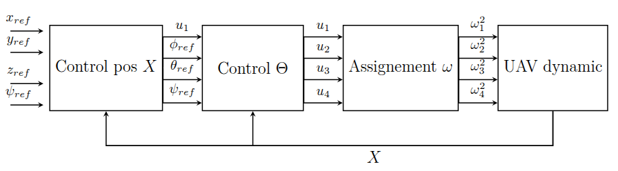
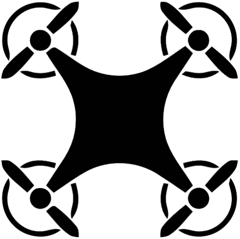
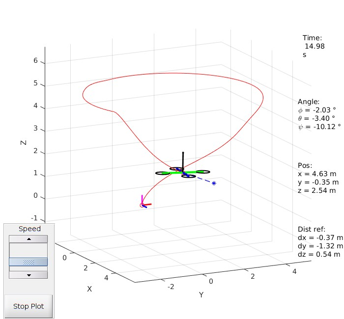

# Quadcopter-control-and-trajectory-visualization

 

<!-- * * -->

## Contents:
- Modelization, simulation and control of a quadcopter UAV
- Visualization of its trajectory and tracking performance 
- Implementation of different nonlinear controlers (**upcoming**)
- Development of state estimators based on noisy measurements and inputs, and performance assessment (**upcoming**)
- Control based on the state estimates (**to do**)
- Add perturbations (wind gust) and parametric uncertainties (**to do**)
- Assess controlers robustness (**to do**)

The quadrotor is modeled using the full 6-DOF Newton–Euler equations (second law of Newton and Euler’s rotation equations), including nonlinear couplings, gyroscopic moments, and cross-inertia effects. 
A reference trajectory is used to evaluate controller precision and robustness (**to do**).

# Quadrotor System Overview

## State vector 

 $X = [x,y,z,\dot{x},\dot{y},\dot{z},\phi,\theta,\psi,\dot{\phi},\dot{\theta},\dot{\psi}],$

where:
- $(x, y, z)$: position
- $\dot{x},\dot{y},\dot{z}$: translational velocity
- $(\phi, \theta, \psi)$: roll, pitch, yaw
- $\dot{\phi},\dot{\theta},\dot{\psi}$: angular velocity

## Control input

- Rotation speed control for each motor (quadcopter: 4 motors)
  
$u =[\omega_1,\omega_2,\omega_3,\omega_4]$

## Control scheme

 </img>

# Goal:

➡️🚩✅ 
<!--  -->
Follow the reference trajectory * 🔵 with the best possible accuracy. 

 

<!-- -->

 </img>
 </img>

<!-- <i>List of functions</i>  -->

## How to use it

1. Add the entire folder to the MATLAB path: `addpath(genpath("path/folder"))`
2. Run the main script `quadcopter_command_main.m` using MATLAB to launch the simulation
3. Run the script `plot3D_anime_body_frame.m` to launch the animation window displaying the 3D trajectory of the quadcopter, its state evolution and the position reference to follow

  
  

  
 <i> 🌟 Loved the project? Add it to your **starred repo** ! 🌟 </i> 

