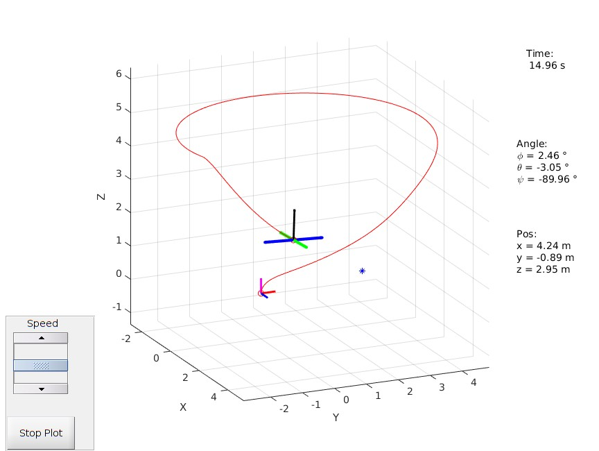

# Quadcopter-control-and-trajectory-visualization

<!--  -->
 

<!-- -->

### Contents:
Modelization, simulation and control of a quadcopter UAV, visualization of its trajectory and tracking performance for different controlers (upcoming).

 </img>

<!-- <i>List of functions</i>  -->

<i>Loved the project? Add it to your starred repo ! </i>

